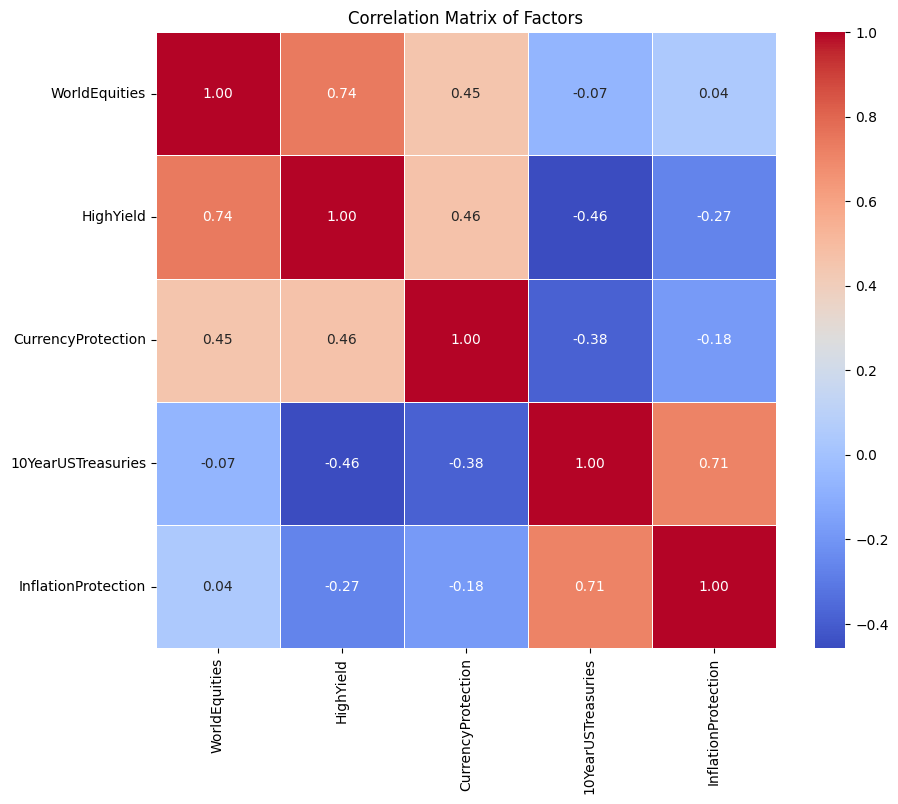

# Lasso Regression Model for Financial Factor Analysis

This project implements a Lasso regression model to analyze the relationship between the S&P 500 Total Return Index (SP500TR) and various financial factors. The goal is to understand how different financial assets influence the performance of the S&P 500.

## Key Features

- **Data Acquisition**: Retrieves daily adjusted close prices for selected financial assets using the `yfinance` library.
- **Return Calculation**: Computes daily returns and calculates Inflation Protection.
- **Lasso Regression**: Applies Lasso regression with cross-validation to find the optimal penalty parameter (alpha).
- **Factor Loadings**: Displays the impact of each financial factor on the S&P 500 (the data chosen was for 2023 to make things simple).
- **Correlation Analysis**: Generates a correlation matrix and calculates the Variance Inflation Factor (VIF) to assess multicollinearity.
- **Model Evaluation**: Includes R² score, cross-validation performance, and a residual plot to evaluate model fit.

## Data Loading

Historical price data (2023) is downloaded from Yahoo Finance for the following symbols:

- **WorldEquities**: `ACWI` (MSCI All Country World Index)
- **HighYield**: `HYG` (High Yield Corporate Bond ETF)
- **CurrencyProtection**: `FXE` (Currency Protection ETF)
- **TIPS**: `TIP` (iShares TIPS Bond ETF)
- **NominalTreasuries**: `IEF` (7-10 Year Treasury Bonds ETF)

The data is converted into a Pandas DataFrame for analysis.

## Return Calculation

Daily returns are calculated for each asset. An Inflation Protection factor is derived by subtracting returns from Nominal Treasuries from TIPS returns.

## Model Training

- **Feature and Target Variables**: Defined and scaled appropriately.
- **Lasso Regression**: Trained using `GridSearchCV` to find the best alpha value.

## Results Display

### Example Output

The Lasso regression model outputs include:

- **Intercept**: [0.0009876933029975444]
- **Factor Loadings**:

    | Factor                 | Loading                       |
    |------------------------|-------------------------------|
    | WorldEquities          | 0.0009876933029975444         |
    | HighYield              | 0.0                           |
    | CurrencyProtection     | -0.0011081486154325439        |
    | 10YearUSTreasuries     | 0.0                           |
    | InflationProtection    | 0.0                           |

### Economic Interpretation

The results suggest that the S&P 500's performance is influenced more by World Equities compared to High Yield Bonds or Treasuries. The minimal impact of Inflation Protection indicates that the S&P 500 may not be directly affected by inflation hedging measures.

## Correlation Analysis

### Correlation Matrix

A correlation matrix visualizes the relationships between the factors:

### Variance Inflation Factor (VIF)

The VIF values indicate multicollinearity among the factors:

| Factor                | VIF       |
|-----------------------|-----------|
| WorldEquities         | 3.14      |
| HighYield             | 3.52      |
| CurrencyProtection    | 1.51      |
| 10YearUSTreasuries    | 2.93      |
| InflationProtection   | 2.09      |

### No Severe Multicollinearity

All VIF values are below 5, suggesting that there is no severe multicollinearity among the factors in your model. This means that the coefficients in your regression model are likely stable and interpretable.

### Performance Metrics

- **R² Score**: [R² Score Value]
- **Cross-Validation R² Scores**: [0.93184481, 0.93392989, 0.94369063, 0.96668209, 0.94933958]
- **Average CV R² Score**: 0.945

A high R² score (close to 1) indicates a good fit. If the score is low, the model may not be capturing much of the variance in the S&P 500 returns. The residual plot should show no patterns, and consistent cross-validation scores suggest that the model generalizes well.
